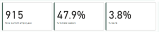

# Alexandra's Portfolio
> [Follow me on LinkedIn](https://www.linkedin.com/in/alexandra-d-641921196/)
> Or mail me at Alexandra@WithHana.com
---

### About Me
Hi I'm Alexandra and I am a digital marketeer turned data analyst. I have a strong business and marketing principles foundation but developed a passion for data. By self-study, freelancing, and pursuing a traineeship in Power BI, I aim to learn more about something I am passionate about: data. 

During my graduate internship, I had the possibility to work with different types of data regarding market intelligence and I developed sufficient skills to gather all needed data into an easy-to-use dashboard for the team. While this opportunity started my love for data, I have now gotten the chance to learn further in a traineeship along with much self-study. I enjoy exploring new data analysis tools and techniques in my free time, and I am always looking for opportunities to expand my knowledge and skills. Whether working on a team or independently, I am driven by the thrill of discovering new insights and the satisfaction of using data to solve complex problems.

_With my strong background in international business and digital marketing, I can turn your data into profit_

---

### Relevant Experience
Freelance Data Analyst @ Vincio Wonen | Sept 2023 - present
- Role: Support Principle data scientist with data cleaning, data modeling, data visualisations, change management, and Power BI training.

Product Marketing Intern @ Signify (f.k.a Philips Lighting) | Jan-Jun 2023
- Assignment: Research and build market intellgence dashboard in Power BI geared towards optimum decision-making
- Impact: Increased awareness of data need in team, supported in creation of company-wide Power BI dashboard

### Certificates
- Signify Power BI beginner training - Iss. April 2023

- Advanced Google Analytics - Iss. April 2021

- Tableau Essential Training (2020.1) - Iss. Dec 2020

- Learning Data Visualization - Nov 2020

### Education
International Business, BBA | Fontys University of Applied Sciences | 2019-2023

### Data Skills
Power BI, Excel, DAX, Data visualisations

---

# Portfolio projects
[1. Demographics HR dashboard | Excel and Power BI](## Demographics HR dashboard)

[2. Interactive blueprint of clothing store | Visio and Power BI](## Interactive blueprint of clothing store)

---

## Demographics HR dashboard
Tools: Excel, Power BI, DAX, visualizations

Goals: The employee dashboard aims to identify the current demographics of the current staff for future recruiting purposes and to check whether, over time, goals of inclusivity and diversity are achieved. The company aims to have 50% females in leadership roles and increase its youngest generation of employees to 8% of the total staff. They also aim to have a balance in terms of race and keep track of bonuses to ensure that longer-term employees get rewarded for their retention and that there is no discrimination in giving out bonuses.

End result: 

Key conclusions: When keeping in mind the set goals for the company, the diversity and inclusion goals are met in terms of ethnicity balance in the company but still needs improvement for females in leadership positions and the amount for Gen Z employees across the company.

### Project trajectory

**Background information:**

This sample data was found online and encompasses basic demographic data regarding the employees of the company. The elements included are Employee ID, Full name, Job title, Department, Business Unit, Gender, Ethnicity, Age, Hire date, Annual salary, Bonus in %, Country, City, and Exit date. The data set merely compasses of one table.
[Source data](https://www.thespreadsheetguru.com/sample-data/)

**Setup:**

To make the work in Power BI smoother, the original data set in Excel was altered. Elements added where Generation, Hire year, Hire month, Salary with bonus included, current employment status (yes/no), Exit year, and Exit month. Besides these elements, two tables have been constructed for Month number and its English month name, and a table with the encompassing continents in case more countries will be added in the future. 

**Dashboard design and creation:**

For the design of the dashboard, the top of the report should entail important KPI’s while the lower part will include visualisations for more detailed data. To enhance the data view, multiple measures were created using DAX, including the percentage of females in leadership roles, the percentage of youngest generation employees, average bonus percentage, average salary, new hires in 2021, total current employees, and total employees. For female leaders, the following job names were assigned to that category: Director, Sr. Manger, Sr. Analyst, Manager, Vice President, IT Coordinator, Sr. Business Partner, and Sr. Account Representative. Furthermore, the reason for the amount of new hires in 2021 specifically and not the current year is due to that this data set only made until 2021 and will not be updated. For the reason showing this statistic in a sample data set, 2021 was chosen instead of the current year which would become not available from 2022 onwards.

Following the measures, a basic outline of the dashboard was created, and the green colour scheme was chosen. 

**Features of the dashboard:**

1.	Parameter

As multiple data in the same form are desired, a parameter was chosen to be used between the department, business unit, generation, and ethnicity. These visuals and matrix will change depending on which parameter is chosen, keeping the overall design of the dashboard simple. 

2.	KPI’s

To easily see whether goals have been reached such as the amount of female leaders or amount of young people in the company, a clear card visual has been added on top of the page

3.	Demographical overview

As the demography of the company is highly important in their inclusion efforts, a simple diagram has been added showing the gender and ethnicity division with division per department visible in the tooltip as seen below.

 

Note that the cursor is on females

4.	Hire year slicer

To see whether the hiring practices in each year are up to standard, a hire year slicer was added.

5.	Clear all slicers

To ensure that the standard view is easily maintained, a clear all filters slicer was added.

**Final product**

After all previous steps, this is the final design of the HR Employee dashboard in Power BI.

[Download files](Assets/DemographicEmployeeData_Excel_PoweBI.zip)

---

## Interactive blueprint of clothing store

TBC
